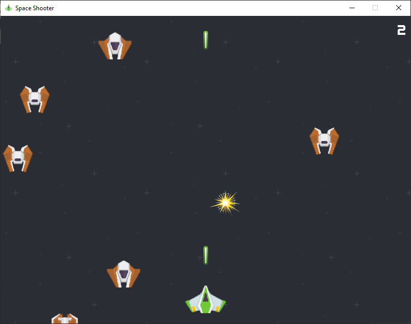

# Curso de Programación de Videojuegos con Pygame

Material de apoyo para un curso sobre Pygame <https://pygame.org>.

Se desarrolla un videojuego tipo "marcianitos" paso a paso, incluyendo sonidos y música.

## Contenido del proyecto
- **Programación de videojuegos con Pygame.pdf**: Presentación completa del curso
- **assets**: directorio que contiene todos los recursos (imágenes, sonidos, fuentes, etc.) para el desarrollo del videojuego.
- **space-shooter.py**: Programa completo del juego
- **1-ventana.py** a **9-sonido.py**: Pasos intermedios de implementación del juego, que se referencian en la presentación.
  - Cada paso es un programa completo, que añade una funcionalidad respecto del anterior.
  - El último paso (*9-sonido.py*) es equivalente al programa completo (*space-shooter.py*)

## Créditos:
- Gráficos: [Space Shooter Redux](https://kenney.nl/assets/space-shooter-redux) by Kenney Vleugels
- Sonidos: [Sci-Fi Sounds](https://kenney.nl/assets/sci-fi-sounds) by Kenney Vleugels
- Música: [Space Ranger](https://uppbeat.io/track/moire/space-ranger) by Moire

